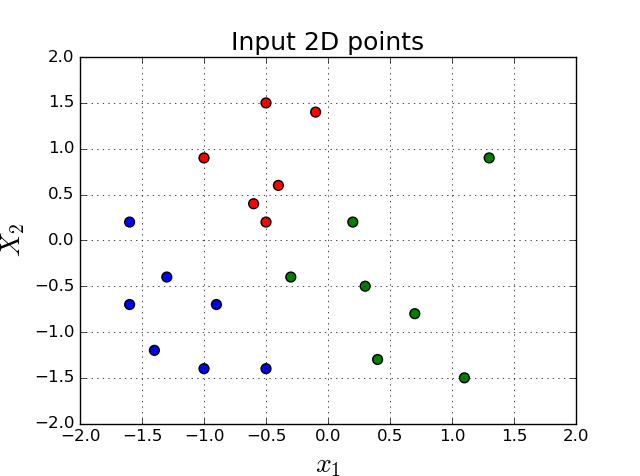
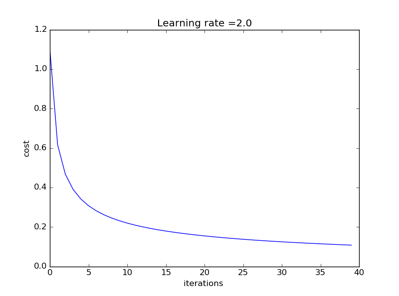
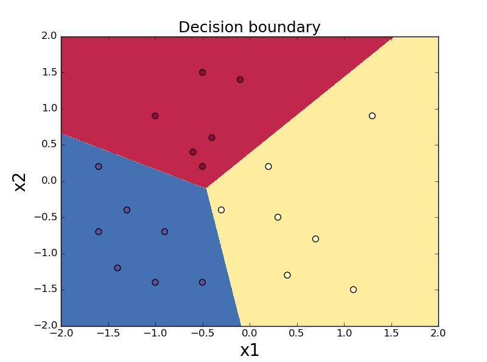

# Softmax_Neural_Network

- The current implemantion shows simple 2D data divided into 3 classes:

- The cost curve for the current single layer implemtaion is:

- The decision boundry after training is:

- The current implentaion is as follows:
  **
Input -> Linear_layer-> Softmax_layer -> output
**
  
- This is implementation is in a computational graph model, thus, fully modular. Any number of layers and and activations can be implemented in any appropriate order

### _References:_
- http://saitcelebi.com/tut/output/part2.html#numerical_stability_of_softmax_function
- https://eli.thegreenplace.net/2016/the-softmax-function-and-its-derivative/
